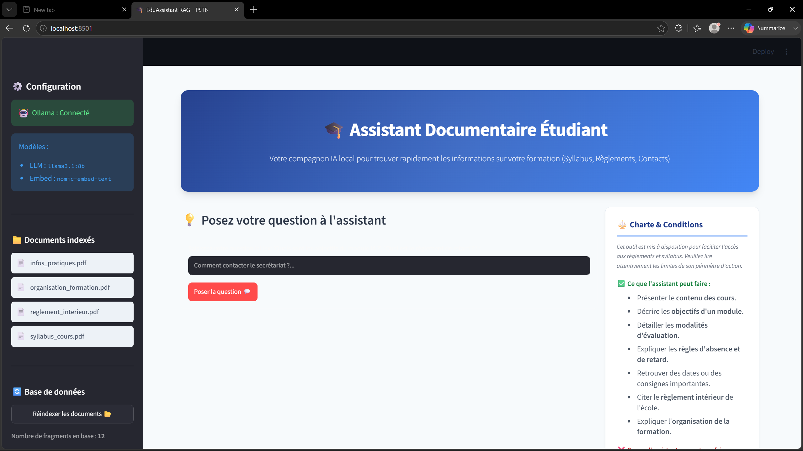

# 🎓 Assistant RAG Local - Gestion Documentaire École

Ce projet met en œuvre un assistant intelligent local (RAG - Retrieval-Augmented Generation) conçu pour aider les étudiants d'un organisme de formation à trouver instantanément des réponses fiables et sourcées à leurs questions quotidiennes.

Il s'appuie exclusivement sur les documents officiels de l'école (Règlement intérieur, Syllabus des cours, Informations pratiques et Contacts) et garantit la confidentialité absolue des données en fonctionnant entièrement en local.

---
## 📱 Démo 
[](Démo.mp4)
> Regarder la démo de l'assistant RAG

---
## 🛠️ Stack Technique

- **Gestionnaire d'environnement** : `uv` (gestion ultra-rapide des dépendances Python)
- **Base de données vectorielle** : `ChromaDB` (stockage persistant local des embeddings)
- **Modèles de langage et d'embedding (Ollama)** :
  - Génération de texte : `llama3.1:8b` (température à 0.0 pour éliminer les hallucinations)
  - Embedding : `nomic-embed-text`
- **Lecteur PDF** : `pypdf`
- **Interface utilisateur** : `Streamlit` (avec design personnalisé premium et moderne)

---

## 📁 Structure du Projet

```text
├── docs/                      # Dépôt des documents officiels (uniquement des fichiers PDF)
│   ├── reglement_interieur.pdf
│   ├── syllabus_cours.pdf
│   └── infos_pratiques.pdf
├── src/                       # Code source de l'application
│   ├── app.py                 # Interface web Streamlit
│   ├── rag.py                 # Cœur de l'application RAG (ingestion, vectorisation, requêtage)
│   └── archive/               # Fichiers historiques du TP
│       ├── etape1.py
│       ├── etape2.py
│       └── main.py
├── scripts/                   # Scripts utilitaires de génération de données
│   ├── generate_docs.py       # Génération automatisée des 3 PDF modèles
│   └── reorganize.py          # Script de réorganisation des fichiers
├── pyproject.toml             # Configuration du projet et dépendances
└── README.md                  # Ce guide
```

---

## 🚀 Installation et Utilisation

### Prerequis

1. **Ollama** doit être installé et en cours d'exécution sur votre machine.
2. Assurez-vous d'avoir téléchargé les deux modèles requis :
   ```bash
   ollama pull llama3.1:8b
   ollama pull nomic-embed-text
   ```

### Lancement de l'Application

Pour installer automatiquement les dépendances du projet et lancer l'application web Streamlit en une seule commande, utilisez `uv` :

```bash
uv run streamlit run src/app.py
```

### Fonctionnalités de l'Interface

- **Recherche Instantanée** : Posez votre question dans la zone de texte (ex: *"Quelles sont les règles pour justifier une absence ?"*).
- **Citations des Sources** : Pour chaque réponse générée, l'assistant affiche les morceaux de texte correspondants, en précisant le document d'origine et la page exacte.
- **Sécurité Anti-Hallucination** : Si l'information n'est pas présente dans les documents, l'assistant répondra strictement *"Je ne sais pas."*.
- **Réindexation Dynamique** : Modifiez, ajoutez ou supprimez des documents PDF dans le dossier `docs/` et cliquez sur le bouton **"Réindexer les documents"** dans le menu latéral pour mettre à jour la base de données vectorielle instantanément.

---

## 📈 Impact Stratégique & ROI (Alignement Métier)

D'un point de vue stratégique et organisationnel, la mise en œuvre de cet assistant présente des bénéfices tangibles :

1. **Optimisation du Temps Administratif (ROI Indirect)** : En répondant automatiquement à 80% des questions répétitives des étudiants (ex: horaires, wifi, contacts), l'assistant libère du temps pour l'équipe pédagogique et administrative. Ce temps peut être réalloué à des tâches d'accompagnement à plus haute valeur ajoutée.
2. **Amélioration de l'Expérience Étudiant (Retention Rate)** : Les étudiants disposent d'un guichet unique disponible 24h/24 pour leurs requêtes. L'accès immédiat à l'information réduit la friction, l'anxiété liée aux examens et les retards de rendu de projets.
3. **Sécurité et Gouvernance des Données** : Le déploiement local via Ollama élimine tout risque de fuite de documents internes ou de données nominatives vers des serveurs tiers (contrairement à l'utilisation d'API comme OpenAI ou Anthropic), un atout majeur en termes de conformité RGPD.